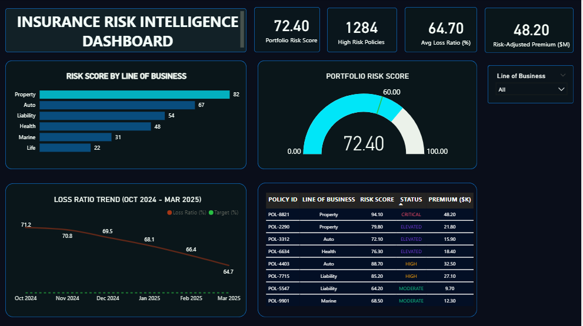

# Insurance-Risk-Intelligence-Dashboard1
A Power BI dashboard analyzing insurance portfolio risk exposure, flagged policies, and loss ratio trends  built from scratch to show what data-driven risk management really looks like.

# Overview

Insurance is not just about covering risk anymore. It is about seeing it before it sees you.

This project started as a learning exercise. It became something more personal. After years of studying insurance, building this dashboard was the moment the numbers stopped being theory and started telling a real story.

# Problem Statement

Insurance portfolios carry hidden risk flagged policies sitting quietly, loss ratios drifting, and concentration risk that nobody is watching. This dashboard was built to surface exactly that.

# Dataset

 • 4 Excel sheets covering:
 • Risk by Line of Business
 • Monthly Trend Analysis
 • Top Risk Policies
 • KPI Summary

# Tools Used

 • Power BI — dashboard design, KPI cards, gauge charts, trend visuals
 
 • Microsoft Excel — data structuring and preparation

# Key Findings

# Risk Exposure by Line of Business
Property lines carry 82% of total risk exposure — a significant concentration that signals portfolio vulnerability.

# High-Risk Policy Flagging
A single policy scored 94.1 out of 100 on the risk index. 1,284 policies were flagged across the portfolio waiting for someone to notice them.

# Loss Ratio Trend
Loss ratio declined from 71.2% to 64.7% over 6 consecutive months. That is not luck — that is what managed, data-informed decision-making looks like.

# Portfolio Optimization Gap
The difference between a loss ratio of 72.4 and 60 is not just a number on a gauge. It is the difference between a portfolio that is managed and one that is optimized.

# The Insight

Data does not just describe what happened. In insurance, it tells you what is coming — if you know how to read it.

# Dashboard Preview

Connect

[LinkedIn](http://linkedin.com/in/gifted-ajamu) | [X](https://x.com/giftedajamu?s=21)
